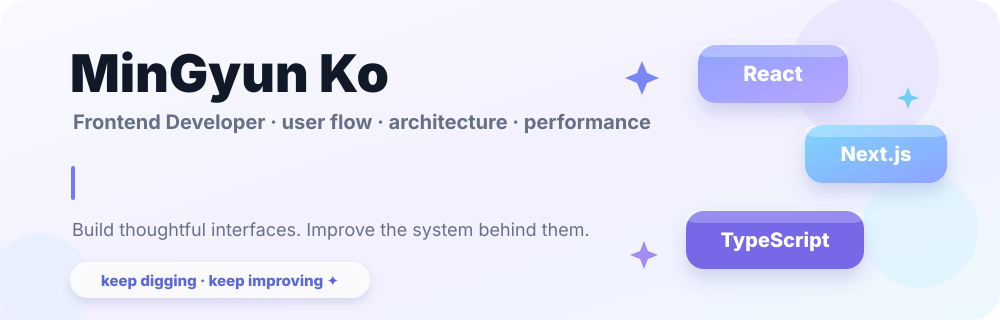
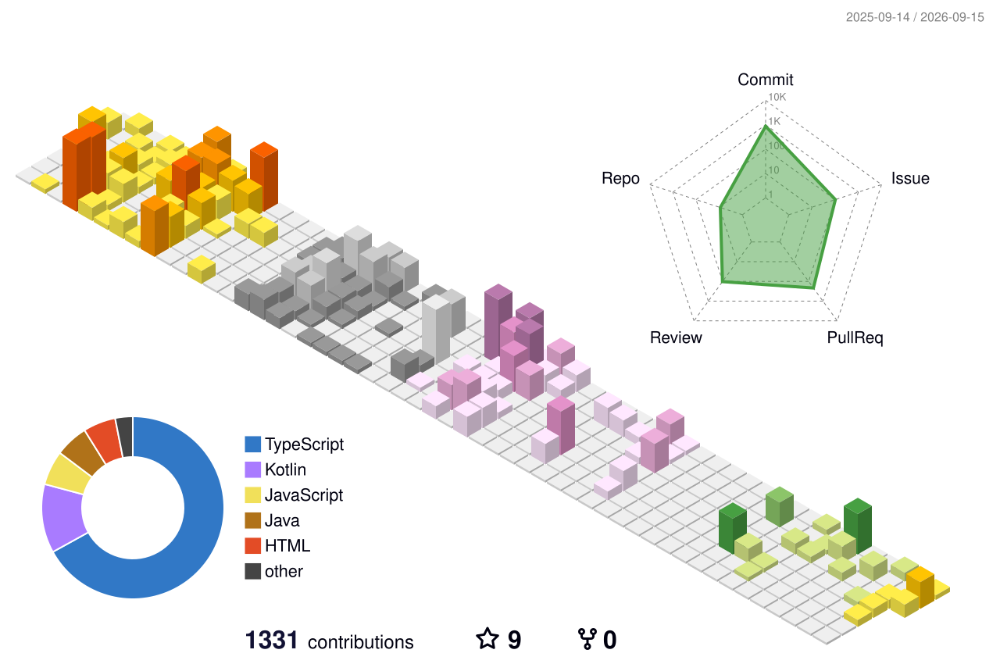

  

 

  <a href="mailto:skybluekmg@gmail.com">Email</a>
  &nbsp;·&nbsp;
  <a href="https://my-blog-min.vercel.app/">Tech Blog</a>
  &nbsp;·&nbsp;
  <a href="https://github.com/skyblue1232">GitHub</a>

 

## About me

**집요한 책임감으로 문제를 구조적인 개선으로 연결합니다.**

사용자 흐름이 자연스럽게 이어지는 화면을 만들고, 팀이 같은 기준으로 개발할 수 있는 구조를 고민하는 프론트엔드 개발자입니다.

- 반복되는 UI와 설정을 **공통 패키지와 Storybook**으로 정리하며 팀의 개발 기준을 맞췄습니다.
- 대용량 이미지·영상이 포함된 서비스에서 **S3 · CloudFront 기반 전달 구조와 로딩 전략**을 개선했습니다.
- **TanStack Query · Zustand**를 활용해 화면 상태와 서버 데이터 흐름을 구조화해 왔습니다.
- 기능 구현에만 머무르지 않고 **요구사항, 역할, 우선순위와 작업 기준을 정리해 팀이 움직이기 쉬운 상태를 만드는 일**에도 참여합니다.
- 최근에는 AI 에이전트를 개발 과정에 활용하며 **요구사항 → 계획 → 구현 → 검증** 흐름을 실험하고 있습니다.

 

## Stack

`React` · `Next.js` · `TypeScript` · `JavaScript` · `TanStack Query` · `Zustand`  
`Tailwind CSS` · `Storybook` · `Turborepo` · `GitHub Actions`  
`AWS S3` · `CloudFront` · `ACM`

 

## Currently exploring

🧩 **Frontend Architecture** — Monorepo, reusable UI, design systems  
⚡ **Performance** — rendering, asset loading, caching, CDN  
☁️ **Infrastructure** — AWS, CI/CD, delivery architecture  
🤖 **AI × Development** — agent workflow, planning, verification

 

## 3D Contribution

  <picture>
    <source media="(prefers-color-scheme: dark)" srcset="./profile-3d-contrib/profile-night-rainbow.svg" />
    <source media="(prefers-color-scheme: light)" srcset="./profile-3d-contrib/profile-season-animate.svg" />
    
  </picture>

 

## Contribution Snake

  <picture>
    <source media="(prefers-color-scheme: dark)" srcset="./assets/github-snake-dark.svg" />
    <source media="(prefers-color-scheme: light)" srcset="./assets/github-snake.svg" />
    
  </picture>

 

  <b>Keep digging. Keep improving.</b> 
  작은 문제를 그냥 넘기지 않고, 더 나은 사용자 경험과 개발 구조를 만들어갑니다.

